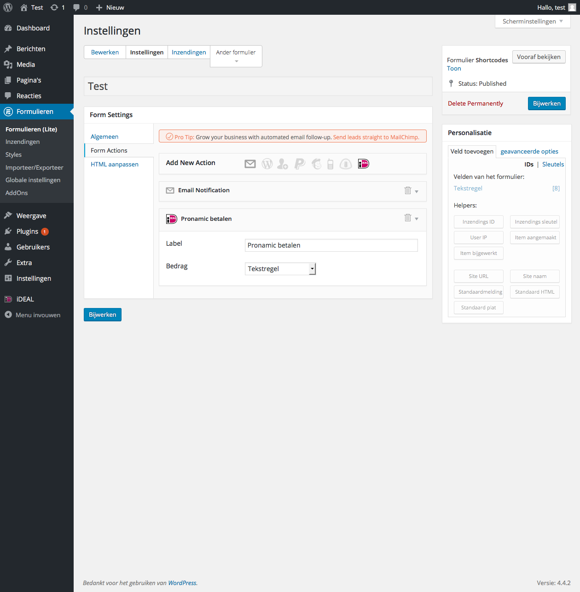
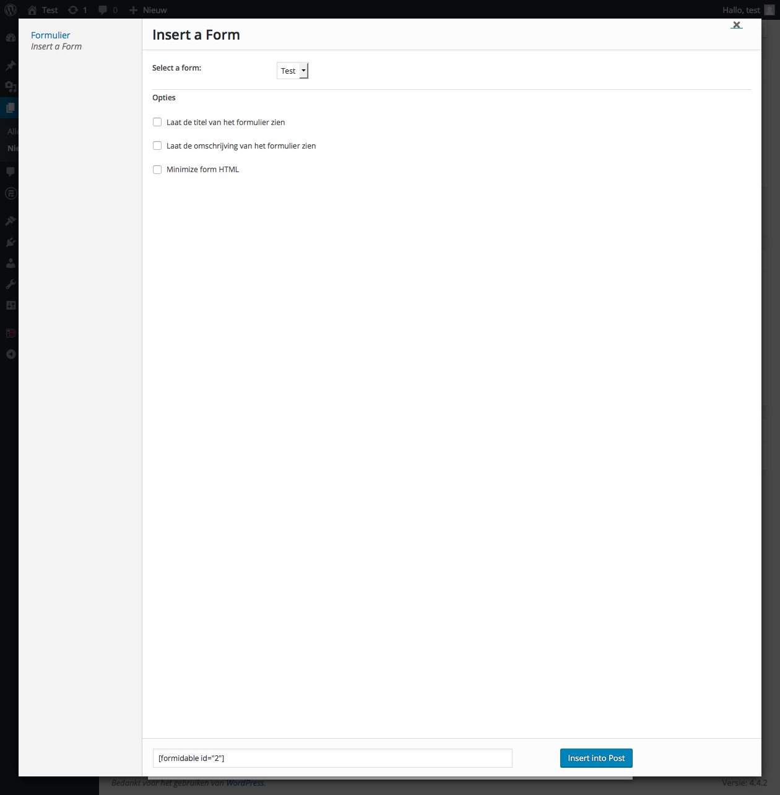
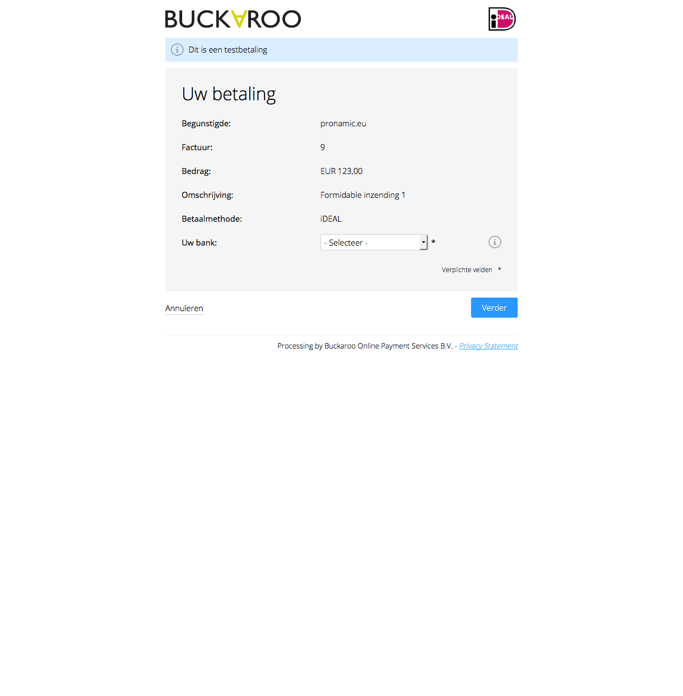

# Pronamic iDEAL, Formidable Forms en Buckaroo

1. Installeer de Pronamic iDEAL plugin
2. Installeer de Formidable Forms plugin
3. [Inloggen in WordPress admin omgeving](#inloggen-in-wordpress-admin-omgeving)
4. [Nieuwe betalingsgateway gateway toevoegen](#nieuwe-betalingsgateway-gateway-toevoegen)
5. [Nieuw Formidable Forms formulier toevoegen](#nieuw-formidable-forms-formulier-toevoegen)
6. [Nieuwe iDEAL formulier actie toevoegen](#nieuwe-ideal-formulier-actie-toevoegen)
7. [Nieuwe pagina aanmaken voor formulier](#nieuwe-pagina-aanmaken-voor-formulier)
8. [Formulier invoegen in pagina](#formulier-invoegen-in-pagina)
9. [Formulier testen](#formulier-testen)
10. [Buckaroo betaling](#buckaroo-betaling)
11. [Buckaroo betalingsstatus](#buckaroo-betalingsstatus)

## Inloggen in WordPress admin omgeving

Om de Pronamic iDEAL plugin te configueren voor Formidable Forms en Buckaroo zal er eerst ingelogd moeten worden in de WordPress admin omgeving. 

## Nieuwe betalingsgateway configuratie toevoegen

Zodra je bent ingelogd moet er een nieuwe betalingsgateway configuratie toegevoegd worden. Dit kan via "**iDEAL** » **Configuraties** » **Nieuwe toevoegen**".

## Nieuw Formidable Forms formulier toevoegen

Vervolgens voegen we een nieuw Formidable Forms formulier toe waarmee de bezoekers een betaling kunnen verrichten. We voegen een "Tekstregel" veld toe zodat bezoekers zelf een te betalen bedrag kunnen opgeven.

## Nieuwe iDEAL formulier actie toevoegen

Na het opslaan van het Formidable Forms formulier kan het formulier uitgebreid worden met een iDEAL formulier actie. Dit zorgt er voor dat bezoekers na het insturen van het formulier doorgestuurd worden naar de iDEAL payment provider.

## Nieuwe pagina aanmaken voor formulier

Zodra het formulier is opgeslagen moet er een nieuwe pagina aangemaakt worden waarop het formulier gepubliceerd kan worden. Bij het toevoegen/bewerken van een pagina kan er via de "**Formulieren**" knop naast de "Media toevoegen" knop een formulier ingevoegd worden.

## Formulier invoegen in pagina

## Formulier testen

## Buckaroo betaling

Na het invullen en insturen van het formulier zal de bezoeker doorgestuurd worden naar de Buckaroo betaalomgeving. Hier kan de bezoeker de gewenste betaalmethode en/of zijn/haar bank kiezen.

## Buckaroo betalingsstatus

In de Buckaroo test modus kan de betalingsstatus eenvoudig gesimuleerd worden. Via een keuzelijst kan de gewenste betalingsstatus opgegeven worden.

