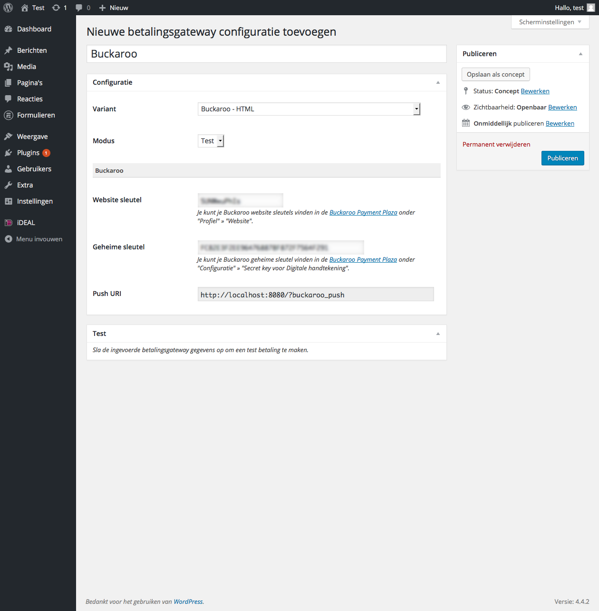
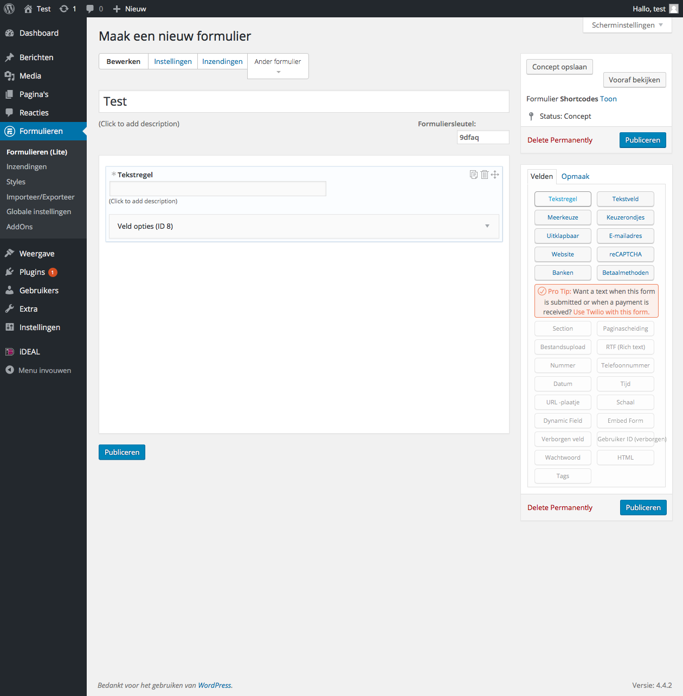
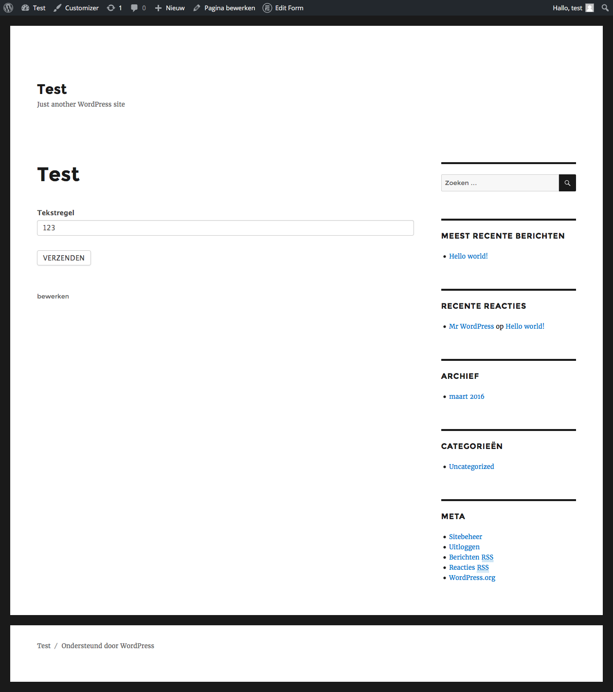
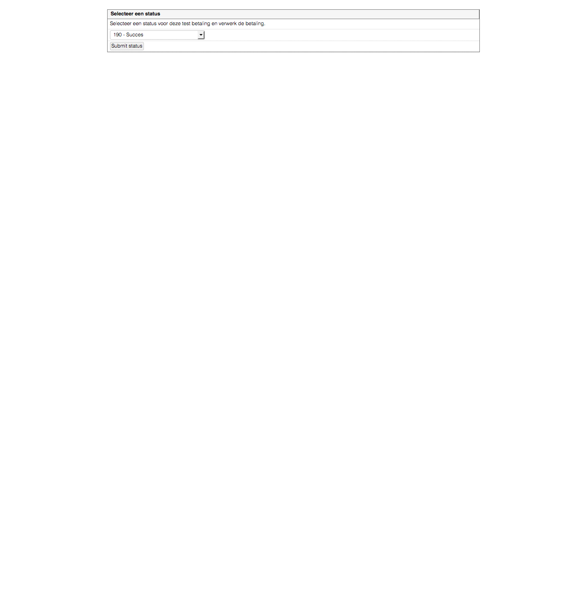

# Pronamic iDEAL, Formidable Forms en Buckaroo

1. Installeer de Pronamic iDEAL plugin
2. Installeer de Formidable Forms plugin
3. [Inloggen in WordPress admin omgeving](#inloggen-in-wordpress-admin-omgeving)
4. [Nieuwe betalingsgateway gateway toevoegen](#nieuwe-betalingsgateway-gateway-toevoegen)
5. [Nieuw Formidable Forms formulier toevoegen](#nieuw-formidable-forms-formulier-toevoegen)
6. [New Form Action](#new-form-action)
7. [New Page](#new-page)
8. [Insert Form](#insert-form)
9. [Fill Form](#fill-form)
10. [Buckaroo Payment](#buckaroo-payment)
11. [Buckaroo Payment Status](#buckaroo-payment-status)

## Inloggen in WordPress admin omgeving

Om de Pronamic iDEAL plugin te configueren voor Formidable Forms en Buckaroo zal er eerst ingelogd moeten worden in de WordPress admin omgeving. 

## Nieuwe betalingsgateway configuratie toevoegen

Zodra je bent ingelogd moet er een nieuwe betalingsgateway configuratie toegevoegd worden. Dit kan via "**iDEAL** » **Configuraties** » **Nieuwe toevoegen**".

## Nieuw Formidable Forms formulier toevoegen

Vervolgens voegen we een nieuw Formidable Forms formulier toe waarmee de bezoekers een betaling kunnen verrichten.

## New Form Action

## New Page

## Insert Form

## Fill Form

## Buckaroo Payment

## Buckaroo Payment Status

